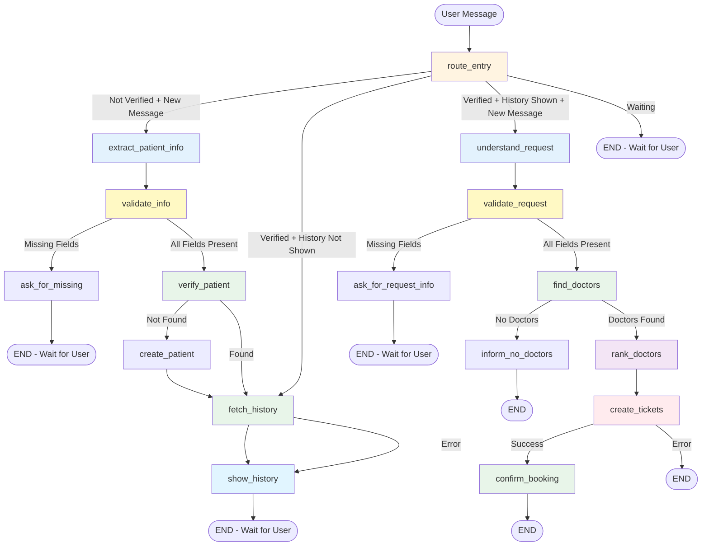

# LangGraph Workflow Documentation

## Overview

This document describes the current LangGraph workflow-based agent system for the Hospital AI Assistant. The system uses a hybrid workflow pattern with explicit nodes for predictable execution, while maintaining conversational flexibility through LLM nodes.

## Table of Contents

1. [System Architecture](#system-architecture)
2. [Workflow Sequence Diagram](#workflow-sequence-diagram)
3. [Node Descriptions](#node-descriptions)
4. [State Management](#state-management)
5. [Data Flow](#data-flow)

---

## System Architecture

### Architecture Diagram

This architecture matches the actual implementation in `backend/src/agents/workflow_agent.py`:

```mermaid
graph TB
    subgraph "Client Layer"
        FE[Frontend React App]
        API[REST API Endpoints<br/>FastAPI]
    end
    
    subgraph "Application Layer"
        CA[Conversation API<br/>routes/conversations.py]
        WA[Workflow Agent<br/>workflow_agent.py<br/>16 nodes]
        TA[Ticket API<br/>routes/tickets.py]
    end
    
    subgraph "LangGraph Engine"
        GE[StateGraph<br/>create_graph]
        CP[PostgresSaver Checkpointer<br/>Auto-save state]
        Nodes[16 Workflow Nodes<br/>route_entry, extract_info,<br/>validate, verify, fetch,<br/>show, understand, find,<br/>rank, create_tickets, etc.]
    end
    
    subgraph "Tool Layer - backend/src/agents/tools/"
        ET[extraction_tools.py<br/>extract_patient_info]
        PT[patient_tools.py<br/>verify_patient, create_patient,<br/>get_patient_history]
        DT[doctor_tools.py<br/>get_available_doctors_by_type_and_time,<br/>rank_doctors_with_llm]
        TT[ticket_tools.py<br/>create_multiple_tickets]
    end
    
    subgraph "LLM Services"
        LLM[ChatOpenAI<br/>model: gpt-4o-mini<br/>temperature: 0.7]
        Struct[Structured Output<br/>Pydantic RequestInfo,<br/>PatientInfo models]
    end
    
    subgraph "Database - PostgreSQL"
        PG[(PostgreSQL)]
        PC[patients]
        DC[service_persons]
        TC[tickets]
        CT[conversations]
        CH[checkpoints]
    end
    
    FE -->|HTTP/REST| API
    API --> CA
    API --> TA
    
    CA -->|await get_graph()| WA
    CA -->|graph.ainvoke(state, config)| WA
    
    WA -->|compile with checkpointer| GE
    GE -->|Execute nodes sequentially| Nodes
    GE -->|After each node| CP
    
    Nodes -->|Call tools| ET
    Nodes -->|Call tools| PT
    Nodes -->|Call tools| DT
    Nodes -->|Call tools| TT
    Nodes -->|Direct LLM calls| LLM
    
    ET -->|Uses| LLM
    ET -->|Structured output| Struct
    DT -->|Uses LLM for ranking| LLM
    
    PT -->|SQL queries| PC
    DT -->|SQL queries| DC
    TT -->|SQL INSERT| TC
    
    CP -->|Save state| CH
    CH -->|Load on resume| CP
    CH -.->|State recovery| CP
    
    CA -->|Create/Load| CT
    
    LLM -->|Traces| LS[LangSmith<br/>Observability & Debugging]
    
    style FE fill:#e1f5ff
    style CA fill:#fff4e1
    style WA fill:#fff4e1
    style GE fill:#e8f5e9
    style Nodes fill:#e8f5e9
    style CP fill:#e8f5e9
    style LLM fill:#f3e5f5
    style Struct fill:#f3e5f5
    style PG fill:#ffebee
    style LS fill:#fff9c4
```

### Component Descriptions

#### Client Layer
- **Frontend React App**: User interface for patients and service personnel
- **REST API Endpoints**: FastAPI endpoints for conversation, tickets, appointments

#### Application Layer
- **Conversation API**: Handles message routing and conversation state
- **Workflow Agent**: Main LangGraph workflow orchestrator
- **Ticket API**: Manages ticket creation and assignment

#### LangGraph Components
- **Graph Engine**: Executes workflow nodes and manages transitions
- **PostgresSaver Checkpointer**: Persists conversation state and messages
- **State Management**: Maintains workflow state (patient info, preferences, etc.)

#### LLM Layer
- **ChatOpenAI**: Language model for extraction, understanding, and formatting
- **Extraction Tools**: Structured output for patient info extraction
- **Ranking Tools**: LLM-based doctor ranking

#### Tool Layer
- **Patient Tools**: Database operations for patient management
- **Doctor Tools**: Doctor search and ranking
- **Ticket Tools**: Ticket creation and management
- **Appointment Tools**: Appointment scheduling

#### Database Layer
- **PostgreSQL Database**: Persistent storage
- **Tables**: Patients, Doctors, Tickets, Conversations, Checkpoints

#### Observability
- **LangSmith**: Tracing and monitoring of LLM calls and workflow execution

---

## Workflow Sequence Diagram

### Complete Workflow Flow

This sequence diagram shows the actual execution flow based on `workflow_agent.py`:

```mermaid
sequenceDiagram
    participant User
    participant API as Conversation API
    participant Graph as LangGraph Engine
    participant Entry as route_entry
    participant Extract as extract_patient_info
    participant Validate as validate_info
    participant AskMissing as ask_for_missing
    participant Verify as verify_patient
    participant Create as create_patient
    participant Fetch as fetch_history
    participant Show as show_history
    participant Understand as understand_request
    participant VReq as validate_request
    participant AskRequest as ask_for_request_info
    participant Find as find_doctors
    participant NoDoctors as inform_no_doctors
    participant Rank as rank_doctors
    participant Tickets as create_tickets
    participant Confirm as confirm_booking
    participant DB as PostgreSQL
    participant LLM as ChatOpenAI
    participant Checkpoint as PostgresSaver

    User->>API: POST /messages
    API->>Graph: graph.ainvoke(initial_state, config)
    Graph->>Checkpoint: Load checkpoint by thread_id
    Checkpoint->>DB: SELECT from checkpoints table
    DB-->>Checkpoint: Existing state (if any)
    Checkpoint-->>Graph: Loaded state with messages
    
    Graph->>Entry: Execute route_entry_node
    
    alt Patient Not Verified
        Entry->>Extract: Execute extract_patient_info_node
        Extract->>LLM: extract_patient_info tool (structured)
        LLM-->>Extract: PatientInfo Pydantic object
        Extract->>Validate: Execute validate_info_node
        
        alt Missing Info
            Validate->>AskMissing: Execute ask_for_missing_node
            AskMissing->>LLM: Generate question prompt
            LLM-->>AskMissing: Question message
            AskMissing-->>API: Add AI message to state
            API-->>User: Response: Ask for missing fields
            Graph->>Checkpoint: Save checkpoint
            Checkpoint->>DB: Save state
            Note over User,Checkpoint: Wait for user response
        else All Info Present
            Validate->>Verify: Execute verify_patient_node
            Verify->>DB: verify_patient tool: SELECT by phone/DOB
            DB-->>Verify: Patient record (or null)
            
            alt Patient Not Found
                Verify->>Create: Execute create_patient_node
                Create->>DB: create_patient tool: INSERT patient
                DB-->>Create: Patient ID
                Create->>Fetch: Execute fetch_history_node
            else Patient Found
                Verify->>Fetch: Execute fetch_history_node
            end
            
            Fetch->>DB: get_patient_history tool: SELECT history_records
            DB-->>Fetch: History records array
            Fetch->>Show: Execute show_history_node
            Show->>LLM: Generate formatted history
            LLM-->>Show: Formatted history message
            Show-->>API: Add AI message to state
            API-->>User: Display history
            Graph->>Checkpoint: Save checkpoint
            Note over User,Checkpoint: Wait for user request
        end
    end
    
    alt Patient Verified - New Request
        Entry->>Understand: Execute understand_request_node
        Understand->>LLM: Structured extraction (service_type, date)
        LLM-->>Understand: RequestInfo object
        Understand->>VReq: Execute validate_request_node
        
        alt Missing Request Info
            VReq->>AskRequest: Execute ask_for_request_info_node
            AskRequest->>LLM: Generate question prompt
            LLM-->>AskRequest: Question message
            AskRequest-->>API: Add AI message to state
            API-->>User: Ask for service type/date
            Graph->>Checkpoint: Save checkpoint
            Note over User,Checkpoint: Wait for user response
        else All Request Info Present
            VReq->>Find: Execute find_doctors_node
            Find->>DB: get_available_doctors_by_type_and_time: SELECT WHERE service_type AND is_active
            DB-->>Find: Available doctors list
            
            alt No Doctors Found
                Find->>NoDoctors: Execute inform_no_doctors_node
                NoDoctors->>LLM: Generate message prompt
                LLM-->>NoDoctors: No doctors message
                NoDoctors-->>API: Add AI message to state
                API-->>User: Inform no availability
                Graph->>Checkpoint: Save checkpoint
            else Doctors Found
                Find->>Rank: Execute rank_doctors_node
                Rank->>LLM: rank_doctors_with_llm tool (with patient history & criteria)
                LLM-->>Rank: Ranked doctor list with reasons
                Rank->>Tickets: Execute create_tickets_node
                Tickets->>DB: create_multiple_tickets tool: INSERT tickets (top N)
                DB-->>Tickets: Ticket IDs array
                Tickets->>Confirm: Execute confirm_booking_node
                Confirm->>LLM: Generate simple confirmation (no doctor details)
                LLM-->>Confirm: Confirmation message
                Confirm-->>API: Add AI message to state
                API-->>User: Booking confirmed
            end
        end
    end
    
    Note over Graph,Checkpoint: After each node execution
    Graph->>Checkpoint: Save checkpoint automatically
    Checkpoint->>DB: INSERT/UPDATE checkpoint
    DB-->>Checkpoint: Checkpoint saved
```

### Detailed Node Flow



---

## Node Descriptions

### Entry Nodes

#### `route_entry`
**Purpose**: Initial routing node that determines workflow entry point based on current state

**Inputs**:
- `patient_verified`: Boolean indicating if patient is verified
- `history_shown`: Boolean indicating if history has been shown
- `messages`: List of messages to detect new user input
- `next_action`: Previously set next action (if continuing workflow)

**Logic**:
- If patient not verified and new user message → route to `extract_patient_info`
- If patient verified but history not shown → route to `fetch_history`
- If patient verified and history shown and new message → route to `understand_request`
- Otherwise → END (wait for user)

**Outputs**:
- Sets `next_action` for routing

---

### Patient Verification Flow

#### `extract_patient_info`
**Purpose**: Extract patient information (name, phone, DOB) from user message using LLM with structured output

**Type**: LLM Node (structured extraction)

**Inputs**:
- `messages`: Conversation messages
- Existing `patient_info` (if any)

**Process**:
1. Uses ChatOpenAI with structured output (Pydantic model)
2. Extracts name, phone, date_of_birth from last user message
3. Merges with existing patient info if present

**Outputs**:
- Updates `patient_info` state with extracted fields
- Sets `next_action` to "validate_info"

---

#### `validate_info`
**Purpose**: Validate that all required patient information is present

**Type**: Validation Node

**Inputs**:
- `patient_info`: PatientInfo object from state

**Process**:
1. Checks for missing required fields (name, phone, date_of_birth)
2. If missing, sets HITL state with pending questions
3. Routes accordingly

**Outputs**:
- Sets `next_action` to "ask_for_missing" or "verify_patient"

---

#### `ask_for_missing`
**Purpose**: Generate LLM message asking for missing patient information

**Type**: LLM Node (conversational)

**Inputs**:
- `hitl.pending_questions`: List of missing fields
- `patient_info`: Currently collected info
- `messages`: Conversation history

**Process**:
1. Builds system prompt with available info and missing fields
2. Calls LLM to generate friendly question
3. Adds response to messages

**Outputs**:
- Adds AI message to conversation
- Sets `next_action` to END (wait for user)

---

#### `verify_patient`
**Purpose**: Verify if patient exists in database

**Type**: Tool Node (database query)

**Inputs**:
- `patient_info`: PatientInfo with name, phone, DOB

**Process**:
1. Calls `verify_patient` tool to query database
2. If found, updates state with `patient_id` and sets `patient_verified = True`
3. If not found, sets `next_action` to "create_patient"

**Outputs**:
- Updates `patient_id` and `patient_verified`
- Sets `next_action` to "fetch_history" or "create_patient"

---

#### `create_patient`
**Purpose**: Create new patient record in database

**Type**: Tool Node (database insert)

**Inputs**:
- `patient_info`: PatientInfo object

**Process**:
1. Calls `create_patient` tool
2. Updates state with new `patient_id`
3. Sets `patient_verified = True`

**Outputs**:
- Updates `patient_id` and `patient_verified`
- Sets `next_action` to "fetch_history"

---

#### `fetch_history`
**Purpose**: Fetch patient medical history from database

**Type**: Tool Node (database query)

**Inputs**:
- `patient_id`: UUID of verified patient

**Process**:
1. Calls `get_patient_history` tool
2. Retrieves all patient history records
3. Stores in `patient_history` state

**Outputs**:
- Updates `patient_history` state
- Sets `next_action` to "show_history"

---

#### `show_history`
**Purpose**: Format and display patient history using LLM

**Type**: LLM Node (formatting)

**Inputs**:
- `patient_history`: History records from database
- `patient_info`: Patient information
- `messages`: Conversation history

**Process**:
1. Builds system prompt with history data
2. Calls LLM to generate friendly, readable format
3. Adds formatted response to messages

**Outputs**:
- Adds AI message with formatted history
- Sets `history_shown = True`
- Sets `next_action` to END (wait for user request)

---

### Appointment Request Flow

#### `understand_request`
**Purpose**: Extract service type and preferred date/time from user message

**Type**: LLM Node (structured extraction)

**Inputs**:
- `messages`: Conversation messages (especially last user message)
- `appointment_preferences`: Existing preferences (if any)
- Available service types from database

**Process**:
1. Uses ChatOpenAI with structured output (RequestInfo model)
2. Extracts: service_type, preferred_date_time, issue_description
3. Maps user description to available service types
4. Converts date/time to ISO format
5. Merges with existing preferences

**Outputs**:
- Updates `appointment_preferences` state
- Sets `next_action` to "validate_request"

---

#### `validate_request`
**Purpose**: Validate that required request information is present

**Type**: Validation Node

**Inputs**:
- `appointment_preferences`: AppointmentPreferences object

**Process**:
1. Checks for missing required fields (service_type, preferred_date_time)
2. If missing, sets HITL state with pending questions
3. Routes accordingly

**Outputs**:
- Sets `next_action` to "ask_for_request_info" or "find_doctors"

---

#### `ask_for_request_info`
**Purpose**: Generate LLM message asking for missing request information

**Type**: LLM Node (conversational)

**Inputs**:
- `hitl.pending_questions`: List of missing fields
- `appointment_preferences`: Currently collected info
- Available service types from database
- `messages`: Conversation history

**Process**:
1. Builds system prompt emphasizing already collected values
2. Only asks for missing information (service_type or date/time)
3. Calls LLM to generate friendly question
4. Adds response to messages

**Outputs**:
- Adds AI message to conversation
- Sets `next_action` to END (wait for user)

---

#### `find_doctors`
**Purpose**: Find available doctors matching service type and time preferences

**Type**: Tool Node (database query)

**Inputs**:
- `appointment_preferences.service_type`: Required service type
- `appointment_preferences.preferred_date_time`: Preferred appointment time

**Process**:
1. Calls `get_available_doctors_by_type_and_time` tool
2. Queries database for active doctors matching service_type
3. Filters by availability and workload

**Outputs**:
- Updates `available_doctors` state
- Sets `doctors_found = True`
- Sets `next_action` to "rank_doctors" or "inform_no_doctors"

---

#### `inform_no_doctors`
**Purpose**: Inform user that no doctors are available

**Type**: LLM Node (conversational)

**Inputs**:
- `appointment_preferences`: Requested service type
- `messages`: Conversation history

**Process**:
1. Builds system prompt with service type context
2. Calls LLM to generate empathetic message
3. Suggests alternatives if appropriate

**Outputs**:
- Adds AI message informing no availability
- Sets `next_action` to END

---

#### `rank_doctors`
**Purpose**: Rank doctors based on patient history and request criteria

**Type**: Tool Node (LLM-based ranking)

**Inputs**:
- `available_doctors`: List of available doctors
- `patient_history`: Patient medical history
- `appointment_preferences`: Service type and description
- `patient_info`: Patient details

**Process**:
1. Calls `rank_doctors_with_llm` tool
2. LLM analyzes doctor expertise, patient history, and request
3. Returns ranked list with reasons for ranking
4. Stores top N doctors in state

**Outputs**:
- Updates `doctor_ranking` state with ranked doctors
- Sets `ranking_success = True`
- Sets `next_action` to "create_tickets"

---

#### `create_tickets`
**Purpose**: Create tickets for top-ranked doctors

**Type**: Tool Node (database insert)

**Inputs**:
- `doctor_ranking.ranked_doctors`: List of ranked doctors (top N)
- `appointment_preferences`: Service type and date/time
- `patient_info`: Patient information
- `patient_history`: Patient history summary
- `conversation_id`: Current conversation ID

**Process**:
1. Generates case summary using LLM
2. Calls `create_multiple_tickets` tool
3. Creates tickets for each doctor with:
   - Patient details
   - Case summary
   - Service type
   - Priority based on service type
   - Assignment status: "open" (pending acceptance)

**Outputs**:
- Updates `ticket_creation` state with created tickets
- Sets `doctor_tickets_created = True`
- Sets `next_action` to "confirm_booking"

---

#### `confirm_booking`
**Purpose**: Generate simple confirmation message for patient

**Type**: LLM Node (conversational)

**Inputs**:
- `appointment_preferences`: Service type and date/time
- `patient_info`: Patient name
- `messages`: Conversation history

**Process**:
1. Builds system prompt emphasizing simplicity
2. **Explicitly excludes** doctor names, ticket IDs, and technical details
3. Calls LLM to generate warm confirmation message
4. Confirms service type and date/time only

**Outputs**:
- Adds simple confirmation AI message
- Sets `next_action` to END
- **Does not include** doctor recommendation metadata in response

---

## State Management

### State Structure

The `AgentState` maintains the following key fields:

```python
{
    "conversation_id": str,
    "patient_id": Optional[str],
    "patient_verified": bool,
    "history_shown": bool,
    
    "patient_info": {
        "name": Optional[str],
        "phone": Optional[str],
        "date_of_birth": Optional[str],
        "patient_id": Optional[str]
    },
    
    "appointment_preferences": {
        "service_type": Optional[str],
        "preferred_date_time": Optional[str],
        "issue_description": Optional[str]
    },
    
    "patient_history": {
        "history_records": List[Dict],
        "error": Optional[str]
    },
    
    "available_doctors": List[Dict],
    "doctors_found": bool,
    
    "doctor_ranking": {
        "ranked_doctors": List[Dict],
        "ranking_success": bool,
        "ranking_error": Optional[str]
    },
    
    "ticket_creation": {
        "doctor_tickets": List[Dict],
        "tickets_creation_success": bool,
        "tickets_created": int,
        "case_summary": Optional[str]
    },
    
    "hitl": {
        "is_waiting_for_input": bool,
        "validation_complete": bool,
        "pending_questions": List[str],
        "collected_responses": Dict
    },
    
    "next_action": str,
    "messages": List[BaseMessage]
}
```

### State Persistence

- **Checkpointer**: PostgresSaver checkpointer persists all state after each node execution
- **Thread ID**: Uses `conversation_id` as thread_id for checkpointing
- **Recovery**: State is automatically loaded when conversation continues
- **Messages**: All messages (HumanMessage, AIMessage, ToolMessage) are stored in checkpoints

---

## Data Flow

### Patient Verification Flow

```
User Message
  ↓
[Extract Patient Info] → LLM structured extraction
  ↓
[Validate Info] → Check required fields
  ├─→ Missing → [Ask for Missing] → User
  └─→ Complete → [Verify Patient] → Database query
       ├─→ Found → [Fetch History]
       └─→ Not Found → [Create Patient] → [Fetch History]
            ↓
[Show History] → LLM formatting → User
```

### Appointment Request Flow

```
User Request
  ↓
[Understand Request] → LLM structured extraction
  ↓
[Validate Request] → Check required fields
  ├─→ Missing → [Ask for Request Info] → User
  └─→ Complete → [Find Doctors] → Database query
       ├─→ None → [Inform No Doctors] → User
       └─→ Found → [Rank Doctors] → LLM ranking
            ↓
[Create Tickets] → Database insert (multiple tickets)
  ↓
[Confirm Booking] → LLM simple confirmation → User
```

---

## Key Design Decisions

### 1. Hybrid Workflow Pattern
- **Explicit nodes** for predictable execution
- **LLM nodes** only for extraction, understanding, and formatting
- **Tool nodes** for all database operations
- **Conditional routing** based on validation checks

### 2. State Management
- **PostgresSaver checkpointer** for persistence
- **State helpers** for type-safe access to nested state
- **Automatic state recovery** on conversation continuation

### 3. Patient Privacy
- **No doctor details** shown to patients after booking
- **Simple confirmation** messages only
- **Ticket IDs and doctor names** excluded from patient-facing responses

### 4. Error Handling
- **Validation nodes** prevent invalid state transitions
- **Tool errors** handled gracefully with informative messages
- **LLM failures** fall back to default messages

### 5. Observability
- **LangSmith integration** for tracing all LLM calls
- **Detailed logging** of state transitions and decisions
- **Checkpoint inspection** for debugging

---

## Workflow Execution Model

### Sequential Execution
Workflow nodes execute **sequentially** in a single invocation cycle:
1. Entry node routes to first workflow node
2. Each node executes and sets `next_action`
3. Routing functions determine next node based on `next_action` and state
4. Process continues until END or waiting for user input

### User Interaction Points
The workflow **ends** (waits for user) at:
- `ask_for_missing` - Waiting for patient info
- `show_history` - After displaying history, waiting for request
- `ask_for_request_info` - Waiting for appointment details

### Automatic Continuation
When user provides new message:
- `route_entry` detects new message
- Routes to appropriate workflow node based on current state
- Workflow continues from where it left off

---

## Future Enhancements

1. **Parallel Execution**: Execute independent nodes in parallel
2. **Caching**: Cache doctor rankings and availability checks
3. **Rate Limiting**: Add rate limiting per patient/conversation
4. **Retry Logic**: Automatic retry for failed tool calls
5. **Metrics**: Track workflow execution times and success rates
6. **A/B Testing**: Test different ranking strategies

---

## References

- [LangGraph Documentation](https://langchain-ai.github.io/langgraph/)
- [LangSmith Tracing](https://smith.langchain.com/)
- [PostgresSaver Checkpointer](https://langchain-ai.github.io/langgraph/how-tos/persistence/postgres/)
- [State Management Optimization](./STATE_MANAGEMENT_OPTIMIZATION.md)
- [Workflow Optimization Analysis](./workflow_optimization_analysis.md)
