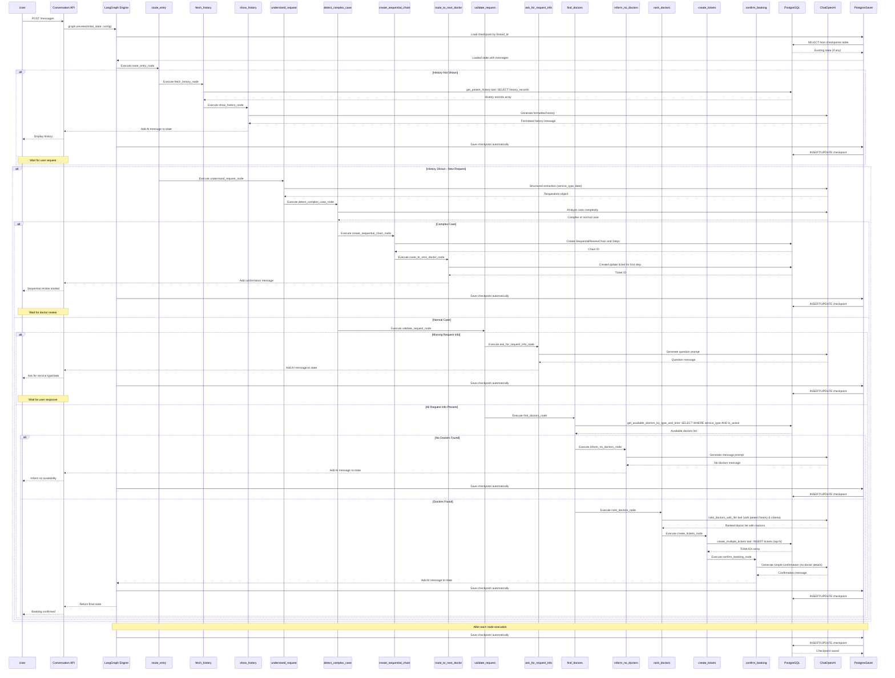
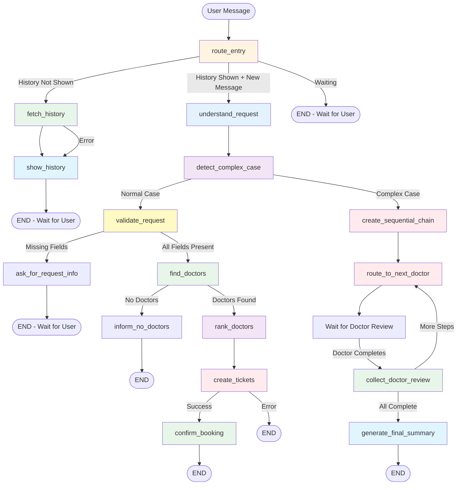

# LangGraph Workflow Documentation

## Overview

This document describes the current LangGraph workflow-based agent system for the Hospital AI Assistant. The system uses a hybrid workflow pattern with explicit nodes for predictable execution, while maintaining conversational flexibility through LLM nodes.

## Table of Contents

1. [System Architecture](#system-architecture)
2. [Workflow Sequence Diagram](#workflow-sequence-diagram)
3. [Node Descriptions](#node-descriptions)
4. [State Management](#state-management)
5. [Data Flow](#data-flow)

---

## System Architecture

### Architecture Diagram

This architecture matches the actual implementation in `backend/src/agents/workflow_agent.py`:

```mermaid
graph TB
    subgraph Frontend["Frontend"]
        FE[React Application<br/>TypeScript + Vite]
        UI[UI Components<br/>Chat, Dashboard,<br/>Ticket Management]
    end
    
    subgraph Backend["Backend"]
        API_GW[REST API Endpoints<br/>FastAPI]
        CA[Conversation API<br/>routes/conversations.py]
        TA[Ticket API<br/>routes/tickets.py]
        PA[Patient API<br/>routes/patients.py]
        WA[Workflow Agent<br/>workflow_agent.py<br/>17 nodes]
        GE[StateGraph<br/>create_graph]
        CP[PostgresSaver Checkpointer<br/>Auto-save state]
        Nodes[17 Workflow Nodes<br/>route_entry, fetch, show,<br/>understand, detect_complex,<br/>create_chain, route_doctor,<br/>collect_review, find, rank,<br/>create_tickets, etc.]
        PT[patient_tools.py<br/>get_patient_history]
        DT[doctor_tools.py<br/>get_available_doctors,<br/>rank_doctors_with_llm]
        TT[ticket_tools.py<br/>create_multiple_tickets]
        CCT[complex_case_tools.py<br/>detect_complex_case,<br/>create_sequential_review_chain,<br/>submit_doctor_review]
        PG[(PostgreSQL)]
        PC[patients]
        DC[service_persons]
        TC[tickets]
        CT[conversations]
        CH[checkpoints]
    end
    
    subgraph AI["AI Services"]
        LLM[ChatOpenAI<br/>model: gpt-4o-mini<br/>temperature: 0.7]
        Struct[Structured Output<br/>Pydantic Models<br/>RequestInfo, PatientInfo]
        LS[LangSmith<br/>Observability & Debugging]
    end
    
    FE -->|HTTP/REST| API_GW
    UI --> FE
    
    API_GW --> CA
    API_GW --> TA
    API_GW --> PA
    
    CA -->|await get_graph()| WA
    CA -->|graph.ainvoke(state, config)| WA
    TA -->|Ticket operations| PG
    PA -->|Patient operations| PG
    
    WA -->|compile with checkpointer| GE
    GE -->|Execute nodes sequentially| Nodes
    GE -->|After each node| CP
    
    Nodes -->|Call tools| PT
    Nodes -->|Call tools| DT
    Nodes -->|Call tools| TT
    Nodes -->|Call tools| CCT
    Nodes -->|Direct LLM calls| LLM
    
    DT -->|Uses LLM for ranking| LLM
    CCT -->|Uses LLM for detection| LLM
    
    PT -->|SQL queries| PC
    DT -->|SQL queries| DC
    TT -->|SQL INSERT| TC
    CA -->|Create/Load| CT
    
    CP -->|Save state| CH
    CH -->|Load on resume| CP
    CH -.->|State recovery| CP
    
    LLM -->|Traces| LS
    Struct -->|Used by| LLM
    
    style Frontend fill:#e1f5ff,stroke:#2196F3,stroke-width:3px
    style Backend fill:#fff4e1,stroke:#FF9800,stroke-width:3px
    style AI fill:#f3e5f5,stroke:#9C27B0,stroke-width:3px
    style FE fill:#e1f5ff
    style UI fill:#e1f5ff
    style API_GW fill:#fff4e1
    style CA fill:#fff4e1
    style TA fill:#fff4e1
    style PA fill:#fff4e1
    style WA fill:#fff4e1
    style GE fill:#e8f5e9
    style Nodes fill:#e8f5e9
    style CP fill:#e8f5e9
    style LLM fill:#f3e5f5
    style Struct fill:#f3e5f5
    style PG fill:#ffebee
    style LS fill:#fff9c4
```

### Component Descriptions

#### Client Layer
- **Frontend React App**: User interface for patients and service personnel
- **REST API Endpoints**: FastAPI endpoints for conversation, tickets, appointments

#### Application Layer
- **Conversation API**: Handles message routing and conversation state
- **Workflow Agent**: Main LangGraph workflow orchestrator
- **Ticket API**: Manages ticket creation and assignment

#### LangGraph Components
- **Graph Engine**: Executes workflow nodes and manages transitions
- **PostgresSaver Checkpointer**: Persists conversation state and messages
- **State Management**: Maintains workflow state (patient info, preferences, etc.)

#### LLM Layer
- **ChatOpenAI**: Language model for extraction, understanding, and formatting
- **Ranking Tools**: LLM-based doctor ranking

#### Tool Layer
- **Patient Tools**: Database operations for patient management
- **Doctor Tools**: Doctor search and ranking
- **Ticket Tools**: Ticket creation and management
- **Complex Case Tools**: Sequential review chain management

#### Database Layer
- **PostgreSQL Database**: Persistent storage
- **Tables**: Patients, Doctors, Tickets, Conversations, Checkpoints

#### Observability
- **LangSmith**: Tracing and monitoring of LLM calls and workflow execution

---

## Workflow Sequence Diagram

### Complete Workflow Flow

This sequence diagram shows the actual execution flow based on `workflow_agent.py`:



### Detailed Node Flow



---

## Node Descriptions

### Complex Case (Sequential Review) Nodes

See [Complex Case (Sequential Review) Flow](#complex-case-sequential-review-flow) section above for detailed descriptions of:
- `detect_complex_case`
- `create_sequential_chain`
- `route_to_next_doctor`
- `collect_doctor_review`
- `generate_final_summary`

### Entry Nodes

#### `route_entry`
**Purpose**: Initial routing node that determines workflow entry point based on current state

**Inputs**:
- `history_shown`: Boolean indicating if history has been shown
- `messages`: List of messages to detect new user input
- `next_action`: Previously set next action (if continuing workflow)

**Logic**:
- If history not shown → route to `fetch_history`
- If history shown and new message → route to `understand_request`
- Otherwise → END (wait for user)

**Outputs**:
- Sets `next_action` for routing

---

### Patient History Flow

#### `fetch_history`
**Purpose**: Fetch patient medical history from database

**Type**: Tool Node (database query)

**Inputs**:
- `patient_id`: UUID of authenticated patient

**Process**:
1. Calls `get_patient_history` tool
2. Retrieves all patient history records
3. Stores in `patient_history` state

**Outputs**:
- Updates `patient_history` state
- Sets `next_action` to "show_history"

---

#### `show_history`
**Purpose**: Format and display patient history using LLM

**Type**: LLM Node (formatting)

**Inputs**:
- `patient_history`: History records from database
- `patient_info`: Patient information
- `messages`: Conversation history

**Process**:
1. Builds system prompt with history data
2. Calls LLM to generate friendly, readable format
3. Adds formatted response to messages

**Outputs**:
- Adds AI message with formatted history
- Sets `history_shown = True`
- Sets `next_action` to END (wait for user request)

---

### Appointment Request Flow

#### `understand_request`
**Purpose**: Extract service type and preferred date/time from user message

**Type**: LLM Node (structured extraction)

**Inputs**:
- `messages`: Conversation messages (especially last user message)
- `appointment_preferences`: Existing preferences (if any)
- Available service types from database

**Process**:
1. Uses ChatOpenAI with structured output (RequestInfo model)
2. Extracts: service_type, preferred_date_time, issue_description
3. Maps user description to available service types
4. Converts date/time to ISO format
5. Merges with existing preferences

**Outputs**:
- Updates `appointment_preferences` state
- Sets `next_action` to "detect_complex_case"

---

#### `detect_complex_case`
**Purpose**: Detect if case requires sequential multi-doctor review

**Type**: Tool Node (LLM-based detection)

**Inputs**:
- `messages`: Conversation messages (especially last user message)
- `patient_history`: Patient medical history
- `current_symptoms`: Current symptoms (if available)

**Process**:
1. Calls `detect_complex_case` tool
2. LLM analyzes case complexity and determines if multiple service types are needed
3. Returns: `is_complex`, `complexity_score`, `complexity_reason`, `suggested_service_types`

**Outputs**:
- Updates `sequential_review` state with detection results
- Sets `case_type` to "complex" or "normal"
- Sets `next_action` to "create_sequential_chain" (if complex) or "validate_request" (if normal)

---

#### `validate_request`
**Purpose**: Validate that required request information is present

**Type**: Validation Node

**Inputs**:
- `appointment_preferences`: AppointmentPreferences object

**Process**:
1. Checks for missing required fields (service_type, preferred_date_time)
2. If missing, sets HITL state with pending questions
3. Routes accordingly

**Outputs**:
- Sets `next_action` to "ask_for_request_info" or "find_doctors"

---

#### `ask_for_request_info`
**Purpose**: Generate LLM message asking for missing request information

**Type**: LLM Node (conversational)

**Inputs**:
- `hitl.pending_questions`: List of missing fields
- `appointment_preferences`: Currently collected info
- Available service types from database
- `messages`: Conversation history

**Process**:
1. Builds system prompt emphasizing already collected values
2. Only asks for missing information (service_type or date/time)
3. Calls LLM to generate friendly question
4. Adds response to messages

**Outputs**:
- Adds AI message to conversation
- Sets `next_action` to END (wait for user)

---

#### `find_doctors`
**Purpose**: Find available doctors matching service type and time preferences

**Type**: Tool Node (database query)

**Inputs**:
- `appointment_preferences.service_type`: Required service type
- `appointment_preferences.preferred_date_time`: Preferred appointment time

**Process**:
1. Calls `get_available_doctors_by_type_and_time` tool
2. Queries database for active doctors matching service_type
3. Filters by availability and workload

**Outputs**:
- Updates `available_doctors` state
- Sets `doctors_found = True`
- Sets `next_action` to "rank_doctors" or "inform_no_doctors"

---

#### `inform_no_doctors`
**Purpose**: Inform user that no doctors are available

**Type**: LLM Node (conversational)

**Inputs**:
- `appointment_preferences`: Requested service type
- `messages`: Conversation history

**Process**:
1. Builds system prompt with service type context
2. Calls LLM to generate empathetic message
3. Suggests alternatives if appropriate

**Outputs**:
- Adds AI message informing no availability
- Sets `next_action` to END

---

#### `rank_doctors`
**Purpose**: Rank doctors based on patient history and request criteria

**Type**: Tool Node (LLM-based ranking)

**Inputs**:
- `available_doctors`: List of available doctors
- `patient_history`: Patient medical history
- `appointment_preferences`: Service type and description
- `patient_info`: Patient details

**Process**:
1. Calls `rank_doctors_with_llm` tool
2. LLM analyzes doctor expertise, patient history, and request
3. Returns ranked list with reasons for ranking
4. Stores top N doctors in state

**Outputs**:
- Updates `doctor_ranking` state with ranked doctors
- Sets `ranking_success = True`
- Sets `next_action` to "create_tickets"

---

#### `create_tickets`
**Purpose**: Create tickets for top-ranked doctors

**Type**: Tool Node (database insert)

**Inputs**:
- `doctor_ranking.ranked_doctors`: List of ranked doctors (top N)
- `appointment_preferences`: Service type and date/time
- `patient_info`: Patient information
- `patient_history`: Patient history summary
- `conversation_id`: Current conversation ID

**Process**:
1. Generates case summary using LLM
2. Calls `create_multiple_tickets` tool
3. Creates tickets for each doctor with:
   - Patient details
   - Case summary
   - Service type
   - Priority based on service type
   - Assignment status: "open" (pending acceptance)

**Outputs**:
- Updates `ticket_creation` state with created tickets
- Sets `doctor_tickets_created = True`
- Sets `next_action` to "confirm_booking"

---

#### `confirm_booking`
**Purpose**: Generate simple confirmation message for patient

**Type**: LLM Node (conversational)

**Inputs**:
- `appointment_preferences`: Service type and date/time
- `patient_info`: Patient name
- `messages`: Conversation history

**Process**:
1. Builds system prompt emphasizing simplicity
2. **Explicitly excludes** doctor names, ticket IDs, and technical details
3. Calls LLM to generate warm confirmation message
4. Confirms service type and date/time only

**Outputs**:
- Adds simple confirmation AI message
- Sets `next_action` to END
- **Does not include** doctor recommendation metadata in response

---

## Complex Case (Sequential Review) Flow

### Overview

For complex cases that require multiple specialists, the system uses a **sequential review chain** where a **single ticket** progresses through multiple doctors in sequence. Each doctor reviews the case and provides notes that are visible to subsequent doctors.

### Key Features

- **Single Ticket**: Only ONE ticket is created for the entire sequential review chain
- **Step Progression**: The ticket progresses through sequential steps (Step 1, Step 2, Step 3, etc.)
- **Auto-Assignment**: Steps are auto-assigned (no accept/reject for sequential review tickets)
- **Review Notes Accumulation**: Review notes from completed steps are visible to subsequent doctors
- **UI Progress Tracking**: The UI shows step progression and review notes from previous doctors

### Sequential Review Nodes

#### `detect_complex_case`
**Purpose**: Detect if case requires sequential multi-doctor review

**Type**: Tool Node (LLM-based detection)

**Inputs**:
- `messages`: Conversation messages (especially last user message)
- `patient_history`: Patient medical history
- `current_symptoms`: Current symptoms (if available)

**Process**:
1. Calls `detect_complex_case` tool
2. LLM analyzes case complexity and determines if multiple service types are needed
3. Returns: `is_complex`, `complexity_score`, `complexity_reason`, `suggested_service_types`

**Outputs**:
- Updates `sequential_review` state with detection results
- Sets `case_type` to "complex" or "normal"
- Sets `next_action` to "create_sequential_chain" (if complex) or "validate_request" (if normal)

---

#### `create_sequential_chain`
**Purpose**: Create sequential review chain with steps for each doctor

**Type**: Tool Node (database insert)

**Inputs**:
- `sequential_review.required_doctors`: List of required service types
- `patient_id`: Patient ID
- `conversation_id`: Current conversation ID

**Process**:
1. Calls `create_sequential_review_chain` tool
2. Creates `SequentialReviewChain` record
3. Creates `SequentialReviewStep` records for each required service type
4. Each step has: `step_index`, `doctor_id` (to be assigned), `status` ("pending")

**Outputs**:
- Updates `sequential_review` state with `chain_id`
- Sets `next_action` to "route_to_next_doctor"

---

#### `route_to_next_doctor`
**Purpose**: Create or update ticket for current step in sequential review chain

**Type**: Tool Node (database insert/update)

**Inputs**:
- `sequential_review.chain_id`: Sequential review chain ID
- `sequential_review.current_step_index`: Current step index
- `patient_info`: Patient information
- `appointment_preferences`: Service type and date/time preferences

**Process**:
1. Gets current step from chain
2. Finds available doctors for the current step's service type
3. **For first step (step_index == 0)**:
   - Creates a NEW ticket assigned to the first doctor
   - Sets ticket status to "assigned" (auto-accepted)
   - Sets `is_sequential_review = True`
   - Sets `sequential_review_chain_id`
   - Links ticket to the step
4. **For subsequent steps (step_index > 0)**:
   - Finds the existing ticket for this chain
   - **Updates** the ticket (reassigns to next doctor):
     - Updates `assigned_to` to next doctor
     - Updates `description` and `llm_summary` with accumulated context from previous steps
     - Sets status to "assigned" (auto-accepted)
     - Updates `assignment_status` to "accepted"
     - Updates `accepted_by` and `accepted_at`
   - Links ticket to the current step
5. Updates chain `current_step_index`

**Outputs**:
- Creates/updates ticket for current step
- Adds confirmation message to state
- Sets `next_action` to "end" (wait for doctor to review)

**Key Design**: Only ONE ticket is used for the entire chain. The ticket is reassigned to subsequent doctors as steps progress.

---

#### `collect_doctor_review`
**Purpose**: Collect doctor review notes and advance chain to next step

**Type**: Tool Node (database update)

**Note**: This node is typically called directly from the API endpoint (`tickets.py`) when a doctor marks the ticket as "completed", not through the workflow graph.

**Inputs**:
- `current_step_id`: Current step ID
- `current_review_notes`: Doctor's review notes
- `current_doctor_id`: Doctor ID

**Process**:
1. Calls `submit_doctor_review` tool
2. Updates current `SequentialReviewStep`:
   - Sets `status` to "completed"
   - Stores `review_notes` and `review_summary`
   - Sets `completed_at`
3. Advances `SequentialReviewChain.current_step_index`
4. Updates chain status (if all steps completed, sets status to "completed")
5. If more steps remain, prepares to route to next doctor

**Outputs**:
- Updates step status to "completed"
- Advances chain to next step
- Sets `next_action` to "route_to_next_doctor" (if more steps) or "generate_final_summary" (if all complete)

---

#### `generate_final_summary`
**Purpose**: Generate final summary when all sequential review steps are complete

**Type**: LLM Node (summary generation)

**Inputs**:
- `sequential_review`: Sequential review state with all steps
- `patient_info`: Patient information
- All review notes from completed steps

**Process**:
1. Collects all review notes and summaries from all steps
2. Calls LLM to generate comprehensive summary
3. Adds summary message to state

**Outputs**:
- Adds final summary AI message
- Sets `next_action` to "end"

---

### Sequential Review Flow Diagram

```
User Request
  ↓
[Understand Request] → LLM extraction
  ↓
[Detect Complex Case] → LLM detection
  ├─→ Normal Case → [Validate Request] → [Find Doctors] → [Rank Doctors] → [Create Tickets] → [Confirm Booking]
  └─→ Complex Case → [Create Sequential Chain] → [Route to Next Doctor]
       ↓
    [Create/Update Ticket] → Single ticket created/updated
       ↓
    [Wait for Doctor Review] → Doctor marks ticket as "completed"
       ↓
    [Collect Doctor Review] → API endpoint (tickets.py) calls submit_doctor_review
       ↓
    [Route to Next Doctor] → Ticket reassigned to next doctor
       ↓
    [Wait for Doctor Review] → Repeat for each step
       ↓
    [All Steps Complete] → [Generate Final Summary] → END
```

### Sequential Review State

```python
{
    "sequential_review": {
        "chain_id": str,
        "is_complex_case": bool,
        "complexity_score": float,
        "complexity_reason": str,
        "required_doctors": List[Dict],  # [{"service_type": "...", "step_index": 0}, ...]
        "current_step_index": int,
        "status": "pending" | "in_progress" | "completed"
    },
    "case_type": "normal" | "complex"
}
```

### Database Tables

**SequentialReviewChain**:
- `chain_id`: Primary key
- `patient_id`: Patient ID
- `conversation_id`: Conversation ID
- `required_doctors_count`: Number of steps
- `current_step_index`: Current step (0-indexed)
- `status`: "pending", "in_progress", "completed"

**SequentialReviewStep**:
- `step_id`: Primary key
- `chain_id`: Foreign key to chain
- `step_index`: Position in sequence (0, 1, 2, ...)
- `doctor_id`: Assigned doctor ID
- `ticket_id`: **Same ticket ID for all steps** (single ticket approach)
- `status`: "pending", "in_review", "completed"
- `review_notes`: Doctor's review notes
- `review_summary`: AI-generated summary
- `started_at`, `completed_at`: Timestamps

**Ticket** (for sequential reviews):
- `ticket_id`: Single ticket ID for entire chain
- `is_sequential_review`: True
- `sequential_review_chain_id`: Foreign key to chain
- `assigned_to`: Current doctor (reassigned as steps progress)
- `status`: "assigned", "in_progress", "completed"
- `assignment_status`: "accepted" (auto-accepted for sequential reviews)

---

## State Management

### State Structure

The `AgentState` maintains the following key fields:

```python
{
    "conversation_id": str,
    "patient_id": Optional[str],
    "patient_verified": bool,
    "history_shown": bool,
    
    "patient_info": {
        "name": Optional[str],
        "phone": Optional[str],
        "date_of_birth": Optional[str],
        "patient_id": Optional[str]
    },
    
    "appointment_preferences": {
        "service_type": Optional[str],
        "preferred_date_time": Optional[str],
        "issue_description": Optional[str]
    },
    
    "patient_history": {
        "history_records": List[Dict],
        "error": Optional[str]
    },
    
    "available_doctors": List[Dict],
    "doctors_found": bool,
    
    "doctor_ranking": {
        "ranked_doctors": List[Dict],
        "ranking_success": bool,
        "ranking_error": Optional[str]
    },
    
    "ticket_creation": {
        "doctor_tickets": List[Dict],
        "tickets_creation_success": bool,
        "tickets_created": int,
        "case_summary": Optional[str]
    },
    
    "sequential_review": {
        "chain_id": Optional[str],
        "is_complex_case": bool,
        "complexity_score": float,
        "complexity_reason": str,
        "required_doctors": List[Dict],
        "current_step_index": int,
        "status": str
    },
    
    "hitl": {
        "is_waiting_for_input": bool,
        "validation_complete": bool,
        "pending_questions": List[str],
        "collected_responses": Dict
    },
    
    "next_action": str,
    "messages": List[BaseMessage]
}
```

### State Persistence

- **Checkpointer**: PostgresSaver checkpointer persists all state after each node execution
- **Thread ID**: Uses `conversation_id` as thread_id for checkpointing
- **Recovery**: State is automatically loaded when conversation continues
- **Messages**: All messages (HumanMessage, AIMessage, ToolMessage) are stored in checkpoints

---

## Data Flow

### Patient History Flow

```
Authenticated Patient
  ↓
[Fetch History] → Database query
  ↓
[Show History] → LLM formatting → User
```

### Appointment Request Flow

```
User Request
  ↓
[Understand Request] → LLM structured extraction
  ↓
[Detect Complex Case] → LLM detection
  ├─→ Normal Case → [Validate Request] → Check required fields
  │    ├─→ Missing → [Ask for Request Info] → User
  │    └─→ Complete → [Find Doctors] → Database query
  │         ├─→ None → [Inform No Doctors] → User
  │         └─→ Found → [Rank Doctors] → LLM ranking
  │              ↓
  │         [Create Tickets] → Database insert (multiple tickets)
  │              ↓
  │         [Confirm Booking] → LLM simple confirmation → User
  │
  └─→ Complex Case → [Create Sequential Chain] → Database insert (chain + steps)
       ↓
    [Route to Next Doctor] → Create/update single ticket
       ↓
    [Wait for Doctor Review] → Doctor marks ticket as "completed"
       ↓
    [Collect Doctor Review] → Update step, advance chain
       ↓
    [Route to Next Doctor] → Reassign ticket to next doctor
       ↓
    [Repeat for each step] → All steps complete
       ↓
    [Generate Final Summary] → LLM summary → User
```

---

## Key Design Decisions

### 1. Sequential Review Design (Complex Cases)
- **Single Ticket Approach**: Only ONE ticket is created for the entire sequential review chain
- **Ticket Reassignment**: The ticket is reassigned to subsequent doctors as steps progress
- **Auto-Assignment**: Sequential review tickets are auto-assigned (no accept/reject required)
- **Review Notes Accumulation**: Review notes from completed steps are visible to subsequent doctors
- **UI Progress Tracking**: The UI displays step progression and review notes from previous doctors
- **State Persistence**: Sequential review state is persisted in checkpoints, allowing recovery if interrupted

### 2. Hybrid Workflow Pattern
- **Explicit nodes** for predictable execution
- **LLM nodes** only for extraction, understanding, and formatting
- **Tool nodes** for all database operations
- **Conditional routing** based on validation checks

### 3. State Management
- **PostgresSaver checkpointer** for persistence
- **State helpers** for type-safe access to nested state
- **Automatic state recovery** on conversation continuation

### 4. Patient Privacy
- **No doctor details** shown to patients after booking
- **Simple confirmation** messages only
- **Ticket IDs and doctor names** excluded from patient-facing responses

### 5. Error Handling
- **Validation nodes** prevent invalid state transitions
- **Tool errors** handled gracefully with informative messages
- **LLM failures** fall back to default messages

### 6. Observability
- **LangSmith integration** for tracing all LLM calls
- **Detailed logging** of state transitions and decisions
- **Checkpoint inspection** for debugging

---

## Workflow Execution Model

### Sequential Execution
Workflow nodes execute **sequentially** in a single invocation cycle:
1. Entry node routes to first workflow node
2. Each node executes and sets `next_action`
3. Routing functions determine next node based on `next_action` and state
4. Process continues until END or waiting for user input

### User Interaction Points
The workflow **ends** (waits for user) at:
- `show_history` - After displaying history, waiting for request
- `ask_for_request_info` - Waiting for appointment details

### Automatic Continuation
When user provides new message:
- `route_entry` detects new message
- Routes to appropriate workflow node based on current state
- Workflow continues from where it left off

---

## Future Enhancements

1. **Parallel Execution**: Execute independent nodes in parallel
2. **Caching**: Cache doctor rankings and availability checks
3. **Rate Limiting**: Add rate limiting per patient/conversation
4. **Retry Logic**: Automatic retry for failed tool calls
5. **Metrics**: Track workflow execution times and success rates
6. **A/B Testing**: Test different ranking strategies

---

## References

- [LangGraph Documentation](https://langchain-ai.github.io/langgraph/)
- [LangSmith Tracing](https://smith.langchain.com/)
- [PostgresSaver Checkpointer](https://langchain-ai.github.io/langgraph/how-tos/persistence/postgres/)
- [State Management Optimization](./STATE_MANAGEMENT_OPTIMIZATION.md)
- [Workflow Optimization Analysis](./workflow_optimization_analysis.md)
